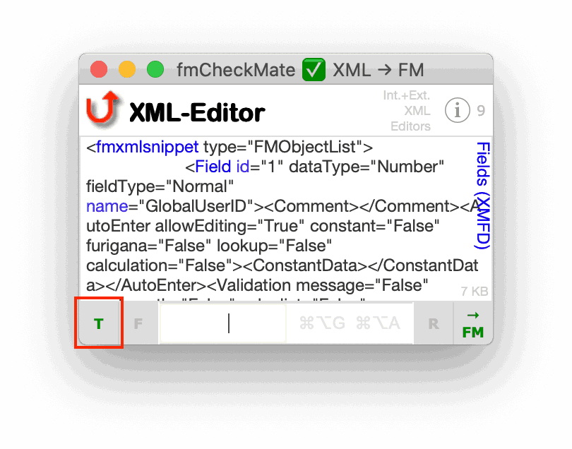
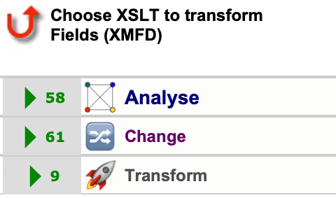

![fmCM.logo][]

# fmCheckMate-XSLT Library

[Transforms your FileMaker work]

The `fmCheckMate-XSLT Library` is a whole bunch of XSL transformations and other functions to transform your FileMaker work … into something very much better!

- It extends the [fmCheckMate][] tool in the [fmWorkMate][] toolbox, giving FileMaker Database Developers the ability to **analyse**, **change** and **transform** their FileMaker code like never before!
- It also has a (not yet very) smart feature to [convert pseudo-code to FileMaker code using fmAutoMate](#convert-pseudo-code-to-fileMaker-code-using-fmautomate)
- It contains XSL transformations to be used with FileMaker export & import

## Getting started

You are not far away from having the best tools that money can't buy! -
It's as easy as ABC:

### A: Prerequisites

To get the most out of the `fmCheckMate-XSLT Library` you will want to be downloadloading and installing MrWatson's fmWorkMate toolbox:

1. Download fmWorkMate from the [fmWorkMate repo][] - [[how?]][MrWs FAQ]

      ![fmWM.logo][]

2. Copy the fmWorkMate folder to your Applications folder (or the Documents folder, or wherever you want)

(and if you are wanting a tighter integration with your Script Workspace, you might also like to [download fmAutomate][fmAutoMate Repo])

### B: Installing this fmCheckMate XSLT Library

Simply:

1. Get hold of the latest fmCheckMate XSLT library:
   - either use the copy in the latest fmWorkMate Bundle (from the [fmWorkMate downloads page][])
   - or download the latest version from the [fmCheckMate-XSLT GitHub repository][]
     - (in which case you need to unpack it and rename the folder simply to fmCheckMate)
2. Copy the fmCheckMate folder to your Documents folder.

That's it!

### C: Doing your first transformation with fmCheckMate

Once you have copied some FileMaker objects, just:

1. Start fmWorkMate, open the fmCheckMate tool.
2. Press the **[Convert Clipboard FM <-> XML]** button
3. Press the **[T]** button in the XML-Editor view.

   

   - Note: if updating your XSLT libarary, press the **[Reimport]** button
     to refresh the XSLT list.
4. Choose an analyse, change or transformation function

   

   -  Note: You can press the **[View]** button to switch between list + tree view
5. Press the **[-> FM]** Button to convert the XML back to FileMaker objects

Then just paste the changed objects back into FileMaker.

### Tip => Always check for pasting errors!

Use one of the following methods to check for errors when pasting objects
back into FileMaker!

- When pasting *Custom Functions*
  --> use an **fmCheckMate XSLT function** to check if custom functions have been commented out,
  
- When pasting *Layout Objects*
  --> use an **fmCheckMate XSLT function** to analyse the layout objects for errors
  
- When pasting *Tables*, *Fields*, *Scripts*, *Steps*, etc.
  --> use [fmLogAnalyser] to check the Import.log

## 2. Next Steps

1. Try out some of the `cool` transformations:

   * Copy some scripts and **analyse** the script calls
   * Copy script steps and **change** a gaggle of Replace Field Contents steps into a Set Field Loop
   * Copy fields and **analyse** them, listing their definitions in one line for easy diffing with fmTextDiff
   * or the `mega-power` function:

     * Copy layout objects and **analyse** them for errors

2. Try converting Pseudo-Code to FileMaker code using [fmAutoMate][]

3. Learn more

   * Google fmCheckMate -> you may find some videos + further help
   * Keep your eye on [FMTraining.tv](https://FMTraining.tv/#LIVE)
   * What's new in this Version?

     * You *may* find some info in the [fmCheckMate_Changes](docs/fmCheckMate_Changes.md) document, but that gets updated so seldom it is more like a grave yard than a newsticker 😂 => so best to keep an eye on the [commit history in GitHub](https://github.com/mrwatson-de/fmCheckMate-XSLT/commits/master) -  even better star the repo and get notifications!

## 3. Give and Take

### License

The fmCheckMate-XSLT library is released completely freely under the [MIT LICENSE](LICENSE.txt), so you are free to do with it what you want.

### Contributing

You can help in many ways to make the fmWorkMate toolbox better for us all.

I would heartily welcome any contributions to the project. See [my GitHub FAQ][MrWs FAQ] for more.

Thanks!

**MrWatson**

[fmAutoMate]: http://www.fmworkmate.com/fmAutoMate
[fmAutoMate Repo]: https://github.com/mrwatson-de/fmAutoMate
[fmWorkMate]: http://www.fmworkmate.com
[fmWorkMate repo]: https://github.com/mrwatson-de/fmWorkMate
[fmWorkMate downloads page]: http://fmworkmate.com/downloads
[fmCheckMate]: http://www.fmworkmate.com/fmcheckmate
[fmCM.logo]: docs/fmCM_XSLT_Folder_sm.png
[fmWM.logo]: https://raw.githubusercontent.com/mrwatson-de/fmWorkMate/master/fmWorkMate_ICON_200x200_sm.png
[fmCheckMate-XSLT GitHub repository]: https://github.com/mrwatson-de/fmCheckMate-XSLT
[MrWs FAQ]: https://github.com/mrwatson-de/mrwatson-de/blob/main/faq.md
